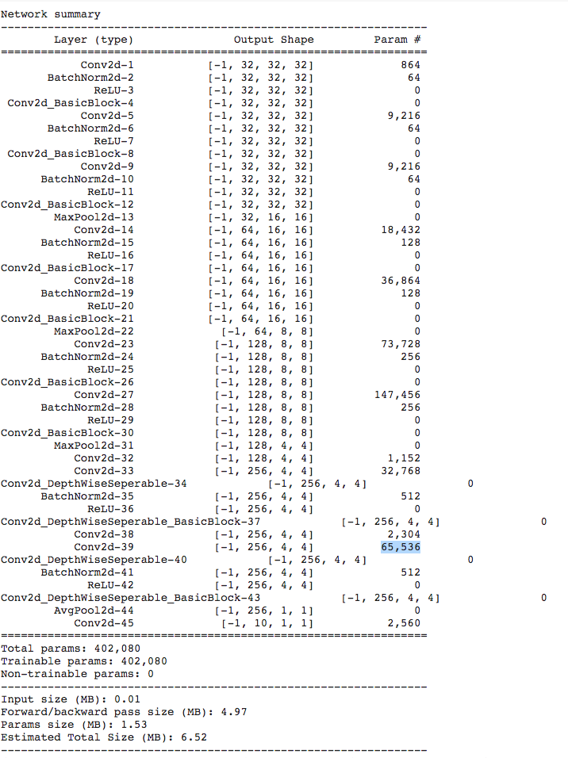

## Session 7 Assignment - Team Submission
Team Members
1. S.A.Ezhirko
2. Naga Pavan Kumar Kalepu
**********************************************************************************************************************
### Experiment 1: Base Model Archicture.
Description :  
* Followed squeeze and expand style of model.
* Added 4 Convolution blocks with 14 layers. Added 3 transitional blocks(Maxpool) at GRF 7x7,GRF 24x24 and GRF 42x42.
* Added dilation factor 2 for 3x3 kernel in 5th and 6th convolution layer.
* Added DepthWiseSeperable convolution on 11th and 12th layer. This reduced the number of parameters.
* Added learning rate = 0.1 and step size = 12 with gamma value = 0.2
* Kept batch size = 4 directly took it from example file.
* Ran it for 50 epoch.
* No image agumentation
Accuracy :  
* Best training accuracy = 85.76 %
* Best test accuracy = 75.23 %

Result:  
* The Model is overfit and need further tunning.
**********************************************************************************************************************
### Experiment 2: Increasing the model capacity and Image agumentation.
Architecture :  
   
Description :  
* Increased the number of parameters to 303,616 
* Increased batch size = 64
* Performed Image rotation to 7 degree and Horizantal Flip.
Accuracy :  
* Best training accuracy = 94.60 %
* Best test accuracy = 86.41 %

Result:  
* We have achived the required accuracy of 80% and above.
* The model is still overfit and can be made efficient.
**********************************************************************************************************************
### Experiment 3: Add RandomCrop to reduce overfitting
Architecture :  
   
Description :  
* Retained Image rotation to 7 degree and Horizantal Flip. Added RandomCrop with padding = 4
Accuracy :  
* Best training accuracy = 90.35% %
* Best test accuracy = 86.88 %

Result:  
* We have achived the required accuracy of 80% and above.
* The model overfitting is slightly reduced.
* The model overfits after 20 epocs and loss is also very stable after 20 epochs. Trainning can be stopped at 20 epochs.
**********************************************************************************************************************
### Final Experiment 4: Final model with VGG kind of Archicture.
Architecture :  

Description :  
* Followed VGG kind of architecture.
* Added C1P1C2P2C3P3C4O structured architecture
* Added dilation rate of 2 for 3x3 kernel in the C2 block
* Added DepthWiseSeperable convolution in the C4 block. This reduced the number of parameters.
* Added learning rate = 0.1 and step size = 12 with gamma value = 0.2
* Kept batch size = 64
* Ran it for 50 epochs
* Image augmentation techniques helped to regularize the model till 30th epcoh and got maximum test accuracy of 89.25%
Accuracy :  
* Best training accuracy = 94.27 %
* Best test accuracy = 89.25 %

Result:  
* The Model is better than the previous models in terms of accuracies but still little overfit.
